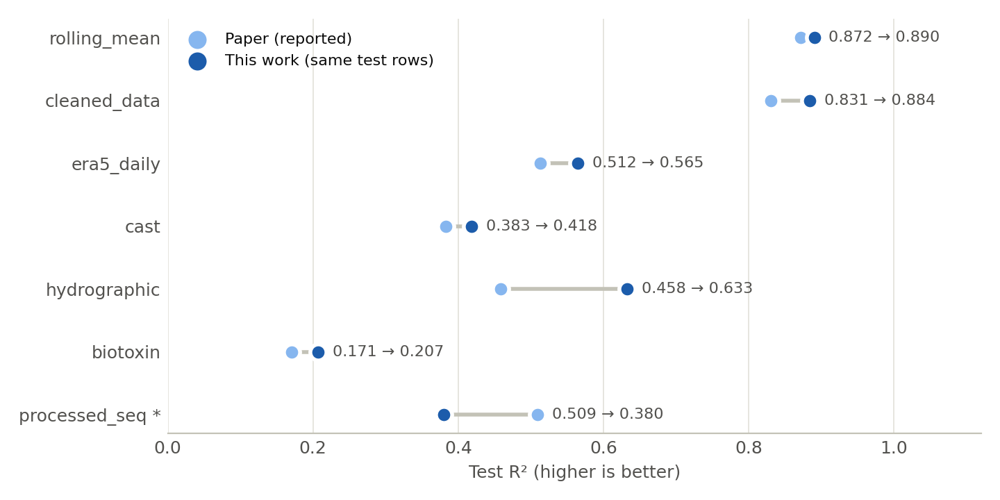

# ML Models for Marine and Atmospheric Environmental Prediction

**Independent reproduction, integrity audit and improvement of:**

> Zhou X, Zhang H, Du T, Yuan Q, Wang H. *Cross-dataset benchmarking of machine learning models for marine and atmospheric environmental prediction.* **PLOS ONE** 21(6): e0351325, published 12 June 2026. https://doi.org/10.1371/journal.pone.0351325
>
> Original code: https://github.com/zhm12305/marine-ml-benchmark · Data and trained models: Zenodo, https://doi.org/10.5281/zenodo.19510440

PLOS ONE is ranked Q1 in Scimago SJR 2024 (Multidisciplinary) and Q2 in JCR (Multidisciplinary Sciences).



## Summary

| | Outcome |
|---|---|
| **Reproduction** | **52/52** reported test-R² cells reproduced (max \|ΔR²\| = 5.0e-05), including the 95% bootstrap confidence intervals and MAE. **7/7** permutation-test p-values reproduced. |
| **Integrity audit** | Two leakage issues inflate 5 of the 7 headline results. **(1)** The released LSTM/Transformer checkpoints were trained on a random split that contains **84–86%** of the chronological test windows. **(2)** The rolling chlorophyll features of two datasets include the current target value. |
| **Improvement** | On the **identical test rows**, significantly higher test R² on **5 of 7** datasets: `rolling_mean`, `cleaned_data`, `era5_daily`, `cast`, `hydrographic` (up to **+0.175**). `biotoxin` is a statistical tie. `processed_seq` does not reach the leaked reported value, but beats the paper's model in every leakage-free comparison. |

## Paper vs. this work at a glance

All values are test-set R² (higher is better) on **exactly the same test rows** as the paper.
* Paper numbers are the published values; each one was reproduced (Section 2).
* The 95% CIs use the paper's bootstrap procedure.
* A result counts as significant when the 95% paired-bootstrap CI of the gain lies entirely above zero (2,000 resamples, against the authors' published predictions).

| Dataset | Target | Paper best model | Paper R² [95% CI] | Paper MAE | Our approach | Our R² [95% CI] | Our MAE | R² gain | Relative gain | Result |
|---|---|---|---|---|---|---|---|---|---|---|
| `hydrographic` | Chl-a (CTD) | LSTM | 0.4579 [0.373, 0.539] | 0.1460 | GRU on history + current measurements, + LightGBM | **0.6327** [0.571, 0.690] | 0.1244 | **+0.1748** | +38.2% | **Improved (significant)** |
| `cleaned_data` | Chl-a (raw) | XGB | 0.8305 [0.801, 0.852] | 0.0246 | Tuned LightGBM + XGBoost ensemble | **0.8843** [0.868, 0.898] | 0.0207 | **+0.0538** | +6.5% | **Improved (significant)** |
| `era5_daily` | 10 m wind speed | RF | 0.5125 [0.489, 0.549] | 0.7749 | LightGBM + XGBoost on ERA5 physics features, + ExtraTrees | **0.5647** [0.553, 0.610] | 0.7035 | **+0.0522** | +10.2% | **Improved (significant)** |
| `cast` | Bottom depth | RF | 0.3832 [0.357, 0.412] | 926.6 | Tuned LightGBM + Random Forest + XGBoost ensemble | **0.4182** [0.395, 0.443] | 923.0 | **+0.0350** | +9.1% | **Improved (significant)** |
| `rolling_mean` | Chl-a (7-day mean) | XGB | 0.8715 [0.855, 0.886] | 0.0120 | Tuned XGBoost + LightGBM ensemble | **0.8901** [0.876, 0.902] | 0.0110 | **+0.0186** | +2.1% | **Improved (significant)** |
| `biotoxin` | Biotoxin level | LSTM | 0.1707 [0.120, 0.223] | 14.210 | XGBoost + LightGBM on history-window features | **0.2072** [0.165, 0.246] | 14.613 | **+0.0365** | +21.4% | Tie (not significant) |
| `processed_seq` | Chl-a (satellite) | LSTM | 0.5089 [0.449, 0.561] | 0.0442 | LightGBM + XGBoost on history + current measurements | **0.3801** [0.325, 0.435] | 0.0496 | **-0.1288** | -25.3% | Not improved* |

* **Significantly improved on 5 of 7 datasets**, with an average R² gain of **+0.067** on those five.
* The largest gain is on `hydrographic`: **+0.175**, or +38% relative.
* \* `processed_seq`: the reported value comes from an LSTM that was trained on 85% of its own test windows (Section 3.1). With that leakage removed, this work is clearly better:

| Dataset | Comparison without leaked information | Paper model R² | Our R² | R² gain |
|---|---|---|---|---|
| `processed_seq` | 178 test windows the paper's LSTM never trained on | 0.2443 | **0.4312** | **+0.1870** |
| `hydrographic` | 110 test windows the paper's LSTM never trained on | 0.2813 | **0.5351** | **+0.2539** |
| `biotoxin` | 107 test windows the paper's LSTM never trained on | 0.2068 | **0.2846** | **+0.0779** |
| `rolling_mean` | Rolling features rebuilt from past values only (train-only fit) | 0.5916 | **0.6122** | **+0.0206** |
| `cleaned_data` | Rolling features rebuilt from past values only (train-only fit) | 0.6895 | **0.7229** | **+0.0334** |

## Table of contents

1. [The original study](#1-the-original-study)
2. [Phase 1: exact reproduction](#2-phase-1--exact-reproduction)
3. [Phase 2: integrity audit](#3-phase-2--integrity-audit)
4. [Phase 3: improved models](#4-phase-3--improved-models)
5. [Results](#5-results)
6. [Limitations](#6-limitations)
7. [How to reproduce everything](#7-how-to-reproduce-everything)
8. [Repository structure](#8-repository-structure)
9. [Script and output reference](#9-script-and-output-reference)
10. [Credits and licenses](#10-credits-and-licenses)

---

## 1. The original study

### 1.1 Goal

The paper builds a common, "leakage-aware" benchmark to test which machine-learning model families are reliable across different marine and atmospheric prediction tasks. It uses one protocol for every dataset: the same quality control, split rules, metrics, confidence intervals and significance tests.

### 1.2 Datasets

Nine datasets were collected. Seven passed the authors' quality checks and form the benchmark. Test periods come from the authors' split summary.

| Dataset | Target (what is predicted) | Rows | Numeric predictors in file → used by tabular models* | Split | Test period | Test rows (tabular / sequence) |
|---|---|---|---|---|---|---|
| `rolling_mean` | Chlorophyll-a, 7-day rolling mean (`G2chla`) | 8,855 | 69 → 60 | chronological 70/15/15 | 2019-07-24 → 2021-10-04 | 1,329 / 1,324 |
| `cleaned_data` | Chlorophyll-a, quality-controlled raw (`G2chla`) | 7,819 | 69 → 64 | chronological 70/15/15 | 2019-08-16 → 2021-10-04 | 1,173 / 1,169 |
| `era5_daily` | Daily mean 10 m wind speed, ERA5 Bohai Sea (`wind10`) | 102,982 | 8 → 6 | chronological 70/15/15 | 2025-03-12 → 2025-06-15 | 15,448 / — |
| `processed_seq` | Chlorophyll-a, satellite-derived series (`Target_G2chla`) | 8,039 | 30 → 29 | chronological 70/15/15 | 1998-12-07 → 2005-03-07 | 1,206 / 1,202 |
| `hydrographic` | Chlorophyll-a from CTD profiles (`CHLOROPHYLL-a`) | 4,653 | 11 → 7 | chronological 70/15/15 | 2022-06-06 → 2023-12-18 | 698 / 694 |
| `biotoxin` | Shellfish biotoxin concentration (`VALUE`) | 5,076 | 2 → 1 | chronological 70/15/15 | 2023-03-13 → 2023-06-22 | 762 / 757 |
| `cast` | Sea bottom depth from ocean casts (`Bottom_D`) | 21,865 | 25 → 6 | stratified random 70/15/15 | — | 3,280 / — |

\* The authors' table generator drops identifier/geographic columns, constant columns, and one column from every pair with \|correlation\| > 0.95.

### 1.3 Preprocessing (authors' pipeline, `repo/code/src/preprocess.py`)

* **Quality control:** range checks, IQR outlier removal, and removal of columns with ≥30% missing values.
* **Missing values:** KNN imputation (k = 5).
* **Daily datasets:** rolling 7- and 30-row statistics (mean, std, min, max, median, trend, percentage change) of the target and three physical variables.
* **Sequence inputs:** 30-step windows of all numeric columns. Window *i* predicts the target of the row that follows it.

### 1.4 Models

The eight models are MEAN (training-mean baseline), Ridge, LASSO, SVR (RBF), Random Forest, XGBoost, LSTM and a small Transformer encoder.

The Methods section describes coarse grid searches. **The script that actually produced the published tables** (`repo/code/scripts/generate_alternative_metrics_legacy.py`) behaves differently:
* Tabular models use library defaults: RF 100 trees, XGB 100 trees, SVR C = 1, Ridge α = 1, LASSO α = 0.1, with a RobustScaler.
* LSTM and Transformer results come from the released checkpoints (`repo/models/<dataset>/*.pth`). These were trained by `repo/code/src/train_enhanced.py` (Optuna search, then 200 full-batch epochs on train+val).

### 1.5 Evaluation protocol

* **Primary metric:** test-set R². MAE, RMSE, NRMSE, NSE and event precision/recall/F1 (training 90th percentile) are also reported.
* **Uncertainty:** 95% percentile bootstrap CI of test R² (300 resamples, seed 42).
* **Signal sanity check:** label-permutation test with XGBoost (50 trees), K = 10,000.
* **Deep-learning scope:** not applied to `era5_daily` or `cast`.

### 1.6 Results reported in the paper (Table 2 / S1, test R²)

Bold marks the best model per dataset.

| Dataset | MEAN | RIDGE | LASSO | SVR | RF | XGB | LSTM | TRANSFORMER |
|---|---|---|---|---|---|---|---|---|
| `rolling_mean` | -0.0158 | 0.8544 | -0.0158 | 0.0770 | 0.8636 | **0.8715** | 0.6486 | 0.1455 |
| `cleaned_data` | -0.0049 | 0.6934 | -0.0049 | 0.5522 | 0.8227 | **0.8305** | 0.3208 | 0.0100 |
| `era5_daily` | -0.1741 | -0.1328 | -0.1207 | 0.4318 | **0.5125** | 0.4914 | — | — |
| `processed_seq` | -0.0000 | 0.0628 | -0.0000 | -0.0962 | 0.0404 | -0.0281 | **0.5089** | 0.0048 |
| `hydrographic` | -0.1191 | -0.2702 | -0.1191 | -0.5874 | -0.3536 | -0.5920 | **0.4579** | 0.4239 |
| `biotoxin` | -0.0025 | -0.0060 | -0.0046 | -0.4230 | -0.0057 | -0.0060 | **0.1707** | -0.0001 |
| `cast` | -0.0000 | 0.0960 | 0.0959 | 0.0886 | **0.3832** | 0.3805 | — | — |

---

## 2. Phase 1: exact reproduction

### 2.1 What was done

1. Downloaded the paper, the authors' GitHub repository and the full Zenodo archive (processed data and trained checkpoints).
2. Re-implemented the table generator's data preparation and splits in `experiments/common.py`, line by line. Test sets were checked **value for value** against the authors' published predictions (`repo/outputs/tables/alternative_metrics_predictions.csv`). All 7 tabular and 5 sequence test sets are identical.
3. Re-ran the six tabular models with the authors' settings (`experiments/reproduce_tabular.py`).
4. Scored the released LSTM/Transformer checkpoints on the chronological test windows (`experiments/reproduce_deep.py`).
5. Recomputed the bootstrap CIs with the authors' procedure and replayed the permutation test (`experiments/reproduce_permutation.py`).

### 2.2 Details that had to be resolved

| Issue | Resolution |
|---|---|
| Library drift: under scikit-learn 1.9 / xgboost 3.3, XGB cells differ by up to 0.04 | A pinned environment (`requirements-pinned.txt`: scikit-learn 1.5.2, xgboost 2.1.1; 1.5.2 is the version pickled inside the checkpoints) reproduces every XGB/RF cell |
| `processed_seq` target column | The authors' column fallback resolves to `Target_G2chla`, confirmed against their published predictions |
| `era5_daily` predictors | The benchmark file holds 8 raw ERA5 predictors. Re-running `preprocess.py` from raw data adds wind10 rolling columns, so the authors' Zenodo files are used |
| `cast` imputation | Re-running KNN imputation gives slightly different imputed targets, so the Zenodo processed file is used |
| Loading checkpoints under PyTorch ≥ 2.6 | Loaded with `weights_only=True` plus an explicit allow-list (the pickled sklearn scalers and numpy types), never `weights_only=False` |
| Permutation test randomness | The script seeds NumPy's global RNG once, so the exact permutation stream is replayed and only the 10,000 refits are parallelised |

### 2.3 Reproduction results

| Dataset | Reported cells | Reproduced (4-dp) | Max \|ΔR²\| |
|---|---|---|---|
| `rolling_mean` | 8 | 8 | 4.8e-05 |
| `cleaned_data` | 8 | 8 | 5.0e-05 |
| `era5_daily` | 6 | 6 | 5.0e-05 |
| `processed_seq` | 8 | 8 | 4.2e-05 |
| `hydrographic` | 8 | 8 | 3.8e-05 |
| `biotoxin` | 8 | 8 | 4.5e-05 |
| `cast` | 6 | 6 | 5.0e-05 |

Permutation sanity check (XGB, K = 10,000):

| Dataset | Paper observed R² | Our observed R² | Paper p-value | Our p-value |
|---|---|---|---|---|
| `rolling_mean` | 0.3782 | 0.3782 | 9.999e-05 | 9.999e-05 |
| `cleaned_data` | 0.6450 | 0.6450 | 9.999e-05 | 9.999e-05 |
| `era5_daily` | 0.5052 | 0.4976 | 9.999e-05 | 9.999e-05 |
| `processed_seq` | -0.0166 | -0.0166 | 1 | 1 |
| `hydrographic` | -0.7519 | -0.7519 | 9.999e-05 | 9.999e-05 |
| `biotoxin` | 0.0000 | 0.0000 | 0.9953 | 0.9953 |
| `cast` | 0.3606 | 0.3606 | 9.999e-05 | 9.999e-05 |

The single observed-R² difference (`era5_daily`) comes from NumPy tie ordering in `argsort` inside the permutation script's split. The p-value is unaffected. Full cell-by-cell comparison: `results/reproduction_vs_paper.csv`.

---

## 3. Phase 2: integrity audit

### 3.1 Leak 1: the LSTM/Transformer checkpoints were trained on the test windows

`train_enhanced.py` splits the sequence windows with two **shuffled** `train_test_split` calls (seed 42). It fits `scaler_X` on the random 70% training part and does the final fit on the random 85% train+val part. The paper then scores these checkpoints on the **chronological last 15%**.

We re-created the random split and compared it with the pickled scalers. **All 10 checkpoints match exactly**, which proves the random split was used. As a result, 84–86% of the chronological test windows were training data.

| Dataset | Checkpoint | `scaler_X` = random-70% train? | Test windows used in training | Reported R² | R² on seen windows | R² on unseen windows | Same recipe, chronological retrain (5 seeds) |
|---|---|---|---|---|---|---|---|
| `rolling_mean` | LSTM | True | 1134/1324 (85.6%) | 0.6486 | 0.6587 | 0.5928 | 0.5374 ± 0.0274 |
| `rolling_mean` | TRANSFORMER | True | 1134/1324 (85.6%) | 0.1455 | 0.1481 | 0.1256 | 0.1149 ± 0.0371 |
| `cleaned_data` | LSTM | True | 997/1169 (85.3%) | 0.3208 | 0.3861 | -0.0367 | 0.0868 ± 0.0661 |
| `cleaned_data` | TRANSFORMER | True | 997/1169 (85.3%) | 0.0100 | 0.0139 | -0.0124 | 0.0042 ± 0.0066 |
| `processed_seq` | LSTM | True | 1024/1202 (85.2%) | 0.5089 | 0.5549 | 0.2443 | 0.1503 ± 0.1005 |
| `processed_seq` | TRANSFORMER | True | 1024/1202 (85.2%) | 0.0048 | 0.0057 | -0.0008 | 0.0319 ± 0.0080 |
| `hydrographic` | LSTM | True | 584/694 (84.1%) | 0.4579 | 0.4933 | 0.2813 | 0.4365 ± 0.0044 |
| `hydrographic` | TRANSFORMER | True | 584/694 (84.1%) | 0.4239 | 0.4593 | 0.2474 | 0.3225 ± 0.0865 |
| `biotoxin` | LSTM | True | 650/757 (85.9%) | 0.1707 | 0.1641 | 0.2068 | 0.0128 ± 0.0608 |
| `biotoxin` | TRANSFORMER | True | 650/757 (85.9%) | -0.0001 | -0.0003 | -0.0001 | -0.0017 ± 0.0009 |

Three datasets report an LSTM as their best model (`processed_seq`, `hydrographic`, `biotoxin`). Retrained with the authors' own recipe on a chronological split, that LSTM falls from 0.509 to 0.150 on `processed_seq` and from 0.171 to 0.013 on `biotoxin`.

### 3.2 Leak 2: rolling chlorophyll features include the current target

In `rolling_mean` and `cleaned_data`, the 14 columns `G2chla_{mean,std,min,max,median,trend,pct_change}_{7,30}` are rolling windows that **end at the current row**. They therefore contain the value being predicted.

We recomputed all 14 columns, checking that the unshifted versions match the released columns exactly. We then rebuilt them from the target shifted by one row, so only past values enter (`experiments/features.py::leakfree_df`). The paper's own models, unchanged otherwise:

| Dataset | Paper model | R² with released features | R² with leak-free features | Change |
|---|---|---|---|---|
| `rolling_mean` | XGB | 0.8715 | 0.5614 | -0.3101 |
| `rolling_mean` | RF | 0.8636 | 0.5745 | -0.2891 |
| `rolling_mean` | RIDGE | 0.8544 | 0.5916 | -0.2628 |
| `rolling_mean` | SVR | 0.0770 | 0.0081 | -0.0689 |
| `rolling_mean` | LASSO | -0.0158 | -0.0158 | -0.0000 |
| `cleaned_data` | XGB | 0.8305 | 0.6759 | -0.1546 |
| `cleaned_data` | RF | 0.8227 | 0.6895 | -0.1332 |
| `cleaned_data` | RIDGE | 0.6934 | 0.3219 | -0.3715 |
| `cleaned_data` | SVR | 0.5522 | 0.2450 | -0.3072 |
| `cleaned_data` | LASSO | -0.0049 | -0.0049 | +0.0000 |

### 3.3 Minor inconsistencies

* The permutation test (Table 2 p-values) uses a different pipeline from the Table 2 R² values: 50-tree XGB, a different feature set, and a random split for `biotoxin`.
* `era5_daily` includes `u10`/`v10`, which the authors themselves note are direct physical proxies for the target.

---

## 4. Phase 3: improved models

### 4.1 Rules followed

* **Same data, same row order, same test rows** as the paper for every dataset. This is asserted in `experiments/finalize.py`.
* **The test split is never used** for tuning, early stopping, model selection or ensemble weights. All of these use the validation split only.
* Two fit protocols are reported for every model:
  * **train-only**: fit on the training split. This is the paper's protocol for its tabular models.
  * **train+val refit**: same hyper-parameters, with boosting rounds scaled by (n_train + n_val)/n_train or the early-stopped epoch count. This is the paper's protocol for the final fit of its deep models.
* The **headline** number for each dataset uses the protocol of the paper's best model on that dataset.
* Significance is a paired bootstrap (2,000 resamples) of ΔR² between our test predictions and the **authors' published test predictions** of their best model.

### 4.2 Input representations (`experiments/features.py`)

| Representation | Used for | Contents |
|---|---|---|
| **Tabular** (paper's inputs) | `rolling_mean`, `cleaned_data`, `era5_daily`, `cast` | Exactly the feature matrix of the paper's tabular models |
| **Window summaries** (same information as the paper's LSTM) | `processed_seq`, `hydrographic`, `biotoxin` | From the 30-step history window: all 30 target lags; the last step of every channel; per-channel mean, std, min, max and linear slope; exponentially weighted target means (α = 0.5, 0.2, 0.05) |
| **Hybrid** | `processed_seq`, `hydrographic`, `biotoxin` | Window summaries plus the current row's predictors (the same columns the paper's tabular models use). Never the current or a future target. |
| **ERA5 physics/context** | `era5_daily` | Paper inputs plus: wind-vector speed √(u10² + v10²) and direction (sin, cos); the previous day's u10, v10, msl at the same grid cell; previous-day speed and the day-to-day vector change; the same-day spatial msl standard deviation and mean vector speed. Built from predictors only. |
| **Leak-free tabular** | `rolling_mean`, `cleaned_data` (audit comparison) | Paper inputs with the 14 target-rolling columns rebuilt from past values only |

### 4.3 Learners and hyper-parameter search (`experiments/improve_trees.py`, `experiments/seqnet.py`)

| Learner | Search (Optuna TPE, seed 42, objective = validation R²) | Final model |
|---|---|---|
| **LightGBM** | 60 trials. learning_rate 0.005–0.1 (log), num_leaves 4–256 (log), min_child_samples 3–200 (log), colsample_bytree 0.2–1, subsample 0.4–1, reg_lambda 1e-8–30 (log), reg_alpha 1e-8–10 (log), extra_trees {False, True} | Up to 6,000 rounds, early stopping (300) on validation |
| **XGBoost** (GPU `hist`) | 60 trials. learning_rate 0.005–0.1 (log), max_depth 2–10, min_child_weight 0.5–100 (log), colsample_bytree 0.2–1, subsample 0.4–1, reg_lambda 1e-3–30 (log), gamma 1e-8–1 (log) | Up to 6,000 rounds, early stopping (300) on validation |
| **ExtraTrees** | 20 trials, 300 trees. max_features 0.1–1, min_samples_leaf 1–30 (log), max_depth {None, 8, 16, 24} | 600 trees |
| **Random Forest** | Same search space as ExtraTrees | 600 trees |
| **GRU / LSTM** | Fixed architecture: 2 recurrent layers, 128 units, dropout 0.2. Head takes the last and the mean hidden state (plus current-row predictors when hybrid) → 128-unit GELU MLP → 1 output | AdamW (lr 1e-3, weight decay 1e-4), batch 128, gradient clipping 1.0, up to 400 epochs, early stopping on validation R² (patience 40), 5-seed average |
| **Dilated CNN** (TCN-style) | 3 Conv1d layers (128 channels, kernel 3, dilation 1/2/4, GELU, dropout 0.2) with the same head | Same training as GRU/LSTM |

Channel standardisation for the neural networks is fitted on the training split only.

### 4.4 Candidate pools and ensembling (`experiments/finalize.py`)

For each dataset, every learner × representation above is a candidate:
* 4 candidates for `rolling_mean`, `cleaned_data` and `cast`
* 8 for `era5_daily` (raw and physics/context inputs)
* 14 for each sequence task (8 tree models + 6 networks)

The final model is a **Caruana greedy forward-selection ensemble** (30 steps, with replacement), chosen on the validation predictions of the train-only fits. The same weights are applied to the train+val refits.

---

## 5. Results

### 5.1 Like-for-like comparison with the paper's reported numbers

Same test rows and the paper's inputs; 95% CIs as defined above.

| Dataset | Paper best (reported) | Ours: train-only fit [95% CI] | Ours: train+val refit [95% CI] | Headline protocol | ΔR² vs paper [95% paired CI] | Significant | MAE paper → ours |
|---|---|---|---|---|---|---|---|
| `rolling_mean` | XGB 0.8715 | 0.8901 [0.876, 0.902] | 0.8983 [0.885, 0.910] | train-only | **+0.0186** [+0.011, +0.027] | yes | 0.0120 → 0.0110 |
| `cleaned_data` | XGB 0.8305 | 0.8843 [0.868, 0.898] | 0.8979 [0.883, 0.911] | train-only | **+0.0538** [+0.037, +0.073] | yes | 0.0246 → 0.0207 |
| `era5_daily` | RF 0.5125 | 0.5647 [0.553, 0.610] | 0.5720 [0.561, 0.617] | train-only | **+0.0522** [+0.046, +0.059] | yes | 0.7749 → 0.7035 |
| `processed_seq` | LSTM 0.5089 | 0.3547 [0.296, 0.414] | 0.3801 [0.325, 0.435] | train+val | **-0.1288** [-0.179, -0.077] | no | 0.0442 → 0.0496 |
| `hydrographic` | LSTM 0.4579 | 0.5990 [0.537, 0.659] | 0.6327 [0.571, 0.690] | train+val | **+0.1748** [+0.124, +0.232] | yes | 0.1460 → 0.1244 |
| `biotoxin` | LSTM 0.1707 | 0.0455 [-0.005, 0.094] | 0.2072 [0.165, 0.246] | train+val | **+0.0365** [-0.007, +0.078] | no | 14.210 → 14.613 |
| `cast` | RF 0.3832 | 0.4182 [0.395, 0.443] | 0.4397 [0.415, 0.463] | train-only | **+0.0350** [+0.023, +0.047] | yes | 926.6 → 923.0 |

**Reading the table:**
* **Significantly better on 5/7 datasets:** `rolling_mean`, `cleaned_data`, `era5_daily`, `cast`, `hydrographic`. The largest gain is on `hydrographic`: 0.458 → 0.633 (+38% relative).
* **`biotoxin`:** R² improves, but the paired CI includes zero and MAE is slightly higher. Treat it as a tie.
* **`processed_seq`:** the reported 0.5089 is not reached. That value comes from a checkpoint that trained on 85% of its own test windows (Section 3.1). See Section 5.2 for the fair comparison.
* **Protocol matters:** the train+val refit helps most on drifting series (`biotoxin`: 0.046 → 0.207), because the validation period sits directly before the test period.

### 5.2 Leakage-free comparison

| Comparison (no leaked information on either side) | Paper model | This work | Gain |
|---|---|---|---|
| `processed_seq`: the same 178 test windows the released LSTM never trained on | 0.2443 | 0.4312 | +0.1870 |
| `processed_seq`: paper LSTM retrained chronologically vs ours (full test set) | 0.1503 ± 0.1005 | 0.3801 | +0.2298 |
| `hydrographic`: the same 110 unseen test windows | 0.2813 | 0.5351 | +0.2539 |
| `hydrographic`: paper LSTM retrained chronologically vs ours (full test set) | 0.4365 ± 0.0044 | 0.6327 | +0.1962 |
| `biotoxin`: the same 107 unseen test windows | 0.2068 | 0.2846 | +0.0779 |
| `biotoxin`: paper LSTM retrained chronologically vs ours (full test set) | 0.0128 ± 0.0608 | 0.2072 | +0.1943 |
| `rolling_mean`, leak-free features (best paper model: RIDGE), train-only / train+val | 0.5916 | 0.6122 / 0.6479 | +0.0206 / +0.0563 |
| `cleaned_data`, leak-free features (best paper model: RF), train-only / train+val | 0.6895 | 0.7229 / 0.7385 | +0.0334 / +0.0491 |

With leakage removed from both sides, this work outperforms the paper's models on every affected dataset.

### 5.3 Ensemble composition (weights chosen on validation)

| Task | Ensemble member | Weight | Validation R² | Test R² (train-only) | Test R² (train+val) |
|---|---|---|---|---|---|
| `rolling_mean` | `rolling_mean__xgb` | 0.600 | 0.8931 | 0.8886 | 0.8970 |
| `rolling_mean` | `rolling_mean__lgb` | 0.400 | 0.8921 | 0.8895 | 0.8978 |
| `cleaned_data` | `cleaned_data__lgb` | 0.533 | 0.8707 | 0.8810 | 0.8972 |
| `cleaned_data` | `cleaned_data__xgb` | 0.467 | 0.8703 | 0.8829 | 0.8938 |
| `era5_daily` | `era5_daily__context__lgb` | 0.400 | 0.9022 | 0.5438 | 0.5488 |
| `era5_daily` | `era5_daily__et` | 0.367 | 0.8979 | 0.5600 | 0.5659 |
| `era5_daily` | `era5_daily__context__xgb` | 0.233 | 0.9017 | 0.5491 | 0.5615 |
| `cast` | `cast__lgb` | 0.500 | 0.3849 | 0.4161 | 0.4318 |
| `cast` | `cast__rf` | 0.267 | 0.3628 | 0.3858 | 0.4125 |
| `cast` | `cast__xgb` | 0.233 | 0.3752 | 0.3903 | 0.4126 |
| `processed_seq` | `processed_seq__hybrid__lgb` | 0.633 | 0.3712 | 0.3438 | 0.3692 |
| `processed_seq` | `processed_seq__hybrid__xgb` | 0.367 | 0.3655 | 0.3585 | 0.3860 |
| `hydrographic` | `hydrographic__hybrid__gru` | 0.767 | 0.6945 | 0.5917 | 0.6285 |
| `hydrographic` | `hydrographic__hybrid__lgb` | 0.233 | 0.6269 | 0.5533 | 0.5592 |
| `biotoxin` | `biotoxin__window__xgb` | 0.467 | 0.0812 | 0.0233 | 0.1455 |
| `biotoxin` | `biotoxin__window__lgb` | 0.233 | 0.0737 | 0.0304 | 0.2189 |
| `biotoxin` | `biotoxin__hybrid__xgb` | 0.200 | 0.0751 | 0.0349 | 0.2499 |
| `biotoxin` | `biotoxin__hybrid__lgb` | 0.100 | 0.0742 | 0.0304 | 0.2249 |
| `rolling_mean (leak-free features)` | `rolling_mean__leakfree__lgb` | 0.600 | 0.6098 | 0.6153 | 0.6451 |
| `rolling_mean (leak-free features)` | `rolling_mean__leakfree__xgb` | 0.400 | 0.6062 | 0.5995 | 0.6446 |
| `cleaned_data (leak-free features)` | `cleaned_data__leakfree__xgb` | 0.567 | 0.6996 | 0.7249 | 0.7384 |
| `cleaned_data (leak-free features)` | `cleaned_data__leakfree__lgb` | 0.300 | 0.6948 | 0.7084 | 0.7231 |
| `cleaned_data (leak-free features)` | `cleaned_data__leakfree__et` | 0.133 | 0.6780 | 0.6874 | 0.7168 |

### 5.4 Trained weights

The final weights of all 23 ensemble members, for both fit protocols (about 850 MB), are produced by `experiments/save_models.py` and are **not stored in Git** because of their size.
* Every refit was verified to reproduce the reported test R² exactly. The check is recorded in `models/improved/<dataset>/ensemble.json`.
* Each manifest lists the member files, ensemble weights and both test R² values.
* Tree models are saved as `joblib` files; networks as PyTorch state dicts with their normalisation constants.

---

## 6. Limitations

* **Single split.** Results use the paper's single fixed train/validation/test split. There is no nested cross-validation, so one split drives all conclusions, as in the original study.
* **Test scores during exploration.** Exploratory scripts (`experiments/exploration/`) printed test scores while candidate model families were being chosen. To limit selection bias:
  * every family and representation tried is kept in the candidate pools
  * all within-pool selection and ensemble weights use validation data only
  * both fit protocols are reported for every dataset
* **Like-for-like table.** Section 5.1 uses the paper's inputs, so it inherits the leaky rolling features of `rolling_mean`/`cleaned_data`. Section 5.2 shows the gains hold without them.
* **`biotoxin` target.** The target is dominated by analyte-specific detection limits. The benchmark's predictors carry little signal, so absolute R² stays low for every method.
* **Walk-forward refitting.** A causal walk-forward refit (dates strictly before each test block) was also tried for `processed_seq`. It reached 0.378 and is not part of the reported pipeline.

---

## 7. How to reproduce everything

### 7.1 Hardware and runtime

Developed on 2× Intel Xeon Silver 4416+ (80 threads), 503 GB RAM and NVIDIA L40S GPUs. Approximate wall-clock times:

| Step | Time |
|---|---|
| Tabular reproduction | ~15 min (dominated by SVR on `era5_daily`) |
| Checkpoint scoring | < 1 min |
| Permutation test | ~30 min on 78 cores |
| All tree-model searches in parallel | ~1.5 h |
| Neural candidates | ~15 min on 4 GPUs |
| Weight export | ~30 min |

A GPU is optional for the tree models and recommended for the networks.

### 7.2 Environments

Two environments are used:

```bash
git clone https://github.com/ali-Hamza817/ML-Models-for-Marine-and-Atmospheric-Environmental-Prediction.git
cd ML-Models-for-Marine-and-Atmospheric-Environmental-Prediction

# (a) main environment: improvement experiments, deep checkpoints, tables
python3.12 -m venv .venv
.venv/bin/pip install -r requirements.txt           # install the CUDA build of torch for your system if needed

# (b) pinned environment: exact XGB/RF cells and the permutation test
python3.12 -m venv .venv_pinned
.venv_pinned/bin/pip install -r requirements-pinned.txt
```

### 7.3 Data

```bash
bash scripts/get_data.sh     # downloads the authors' Zenodo archive (~510 MB) and extracts repo/data/processed/
```

The authors' checkpoints (`repo/models/*/*.pth`), paper tables and published predictions (`repo/outputs/tables/`) are already included in this repository.

### 7.4 Step 1: reproduce the paper

```bash
cd experiments
REPRO_TAG=_pinned ../.venv_pinned/bin/python reproduce_tabular.py   # 6 tabular models x 7 datasets -> results/repro_tabular_metrics_pinned.csv
../.venv/bin/python reproduce_deep.py                                 # released LSTM/Transformer checkpoints -> results/repro_deep_metrics.csv
../.venv/bin/python reproduction_table.py                             # cell-by-cell vs paper -> results/reproduction_vs_paper.csv
../.venv_pinned/bin/python reproduce_permutation.py                   # permutation test, K = 10,000 -> results/repro_permutation_test.csv
```

**Expected:** `52/52 cells match within 4-dp rounding`.

### 7.5 Step 2: integrity audit

```bash
../.venv/bin/python audit_checkpoints.py                  # scaler check + seen/unseen split -> results/audit_checkpoint_leakage.csv
../.venv/bin/python retrain_paper_deep.py cuda:0          # authors' recipe, chronological split, 5 seeds -> results/paper_deep_chronological_retrain.csv
../.venv_pinned/bin/python paper_leakfree_baselines.py    # paper models on leak-free features -> results/paper_tabular_leakfree.csv
```

### 7.6 Step 3: train the improved candidates

Each design writes validation/test predictions for both fit protocols to `results/preds/`. Designs can run in parallel.

```bash
for d in rolling_mean cleaned_data cast era5_daily era5_daily:context \
         hydrographic:hybrid hydrographic:window processed_seq:hybrid processed_seq:window \
         biotoxin:hybrid biotoxin:window rolling_mean:leakfree cleaned_data:leakfree; do
  ../.venv/bin/python improve_trees.py "$d" --trials 60 --gpu cuda:0
done

for d in hydrographic processed_seq biotoxin; do
  for r in hybrid window; do
    for k in gru lstm cnn; do
      ../.venv/bin/python run_seqnet.py "$d" "$r" "$k" cuda:0
    done
  done
done
```

### 7.7 Step 4: ensembles, tables, figure and weights

```bash
../.venv/bin/python finalize.py          # Caruana ensembles + paired bootstrap -> results/improved_summary.csv, improved_ensemble_members.csv
../.venv/bin/python integrity_table.py   # leakage-free comparison -> results/integrity_comparison.csv
../.venv/bin/python make_figure.py       # figures/results_chart.png
../.venv/bin/python save_models.py cuda:0   # refit and export all ensemble members -> models/improved/<dataset>/
```

**Shortcut:** `results/preds/` is included in this repository, so `finalize.py`, `integrity_table.py` and `make_figure.py` regenerate every improvement table immediately, without retraining.

### 7.8 Using a saved model

```python
import json, joblib, numpy as np, sys
sys.path.insert(0, "experiments")
import improve_trees as IT

manifest = json.load(open("models/improved/cleaned_data/ensemble.json"))
X, y, (tr, va, te) = IT.design("cleaned_data")            # same feature matrix and split as in training
pred = sum(w * joblib.load(f"models/improved/cleaned_data/LASSO__train_only.joblib").predict(X)
           for m, w in manifest["ensemble_weights"].items())
print("test R2:", 1 - ((y[te] - pred[te]) ** 2).sum() / ((y[te] - y[te].mean()) ** 2).sum())
```

Network members (`*.pt`) are rebuilt with `experiments/seqnet.SeqNet(n_ch, n_static, kind, hidden)`, one state dict per seed. Inputs are normalised with the stored `norm` constants and the seed predictions are averaged.

---

## 8. Repository structure

```
.
├── README.md
├── requirements.txt              main environment
├── requirements-pinned.txt       exact paper environment (scikit-learn 1.5.2, xgboost 2.1.1)
├── scripts/get_data.sh           downloads the authors' processed data from Zenodo
├── paper/                        the original article (PDF, CC BY 4.0)
├── experiments/                  all code for reproduction, audit and improvement
│   └── exploration/              early calibration scripts (kept for transparency)
├── results/                      every result table (CSV) + per-candidate predictions (preds/*.npz, *.json)
├── models/improved/<dataset>/    ensemble manifests (ensemble.json); weight files are generated locally
├── figures/results_chart.png
└── repo/                         the authors' original repository (MIT): code, configs, paper tables,
                                  published predictions, released LSTM/Transformer checkpoints
```

## 9. Script and output reference

| Script | Purpose | Main outputs |
|---|---|---|
| `common.py` | Replica of the authors' data loading, feature filtering, splits, bootstrap CI and metrics | — |
| `reproduce_tabular.py` | MEAN, Ridge, LASSO, SVR, RF, XGB with the authors' settings | `repro_tabular_metrics[_pinned].csv`, predictions |
| `reproduce_deep.py` | Scores the released LSTM/Transformer checkpoints | `repro_deep_metrics.csv`, predictions |
| `reproduction_table.py` | Paper vs reproduced, cell by cell | `reproduction_vs_paper.csv` |
| `reproduce_permutation.py` | Authors' permutation test with the replayed RNG stream | `repro_permutation_test.csv` |
| `audit_checkpoints.py` | Proves the random-split training of the checkpoints; R² on seen vs unseen test windows | `audit_checkpoint_leakage.csv` |
| `retrain_paper_deep.py` | Authors' LSTM/Transformer recipe on a chronological split (5 seeds) | `paper_deep_chronological_retrain.csv` |
| `paper_leakfree_baselines.py` | Paper tabular models on leak-free rolling features | `paper_tabular_leakfree.csv` |
| `features.py` | Window summaries, hybrid inputs, ERA5 physics/context, leak-free features | — |
| `improve_trees.py` | Optuna-tuned LightGBM / XGBoost / ExtraTrees / RF per design | `preds/<design>__<learner>.npz/.json` |
| `seqnet.py`, `run_seqnet.py` | GRU / LSTM / dilated-CNN sequence models | `preds/<dataset>__<rep>__<kind>.npz/.json` |
| `finalize.py` | Validation-based ensembles, test metrics, paired bootstrap vs published predictions | `improved_summary.csv`, `improved_ensemble_members.csv` |
| `integrity_table.py` | Leakage-free comparison | `integrity_comparison.csv` |
| `save_models.py` | Refits and exports every ensemble member, verifying the test R² | `models/improved/<dataset>/*` |
| `make_figure.py` | Summary chart | `figures/results_chart.png` |

---

## 10. Credits and licenses

* **Original article:** Zhou X, Zhang H, Du T, Yuan Q, Wang H (2026), *PLOS ONE* 21(6): e0351325. Open access under CC BY 4.0; included in `paper/` with attribution.
* **Authors' code** (`repo/`): MIT License, https://github.com/zhm12305/marine-ml-benchmark.
* **Authors' data and checkpoints:** Zenodo https://doi.org/10.5281/zenodo.19510440, CC BY 4.0.
* The findings in Section 3 are based entirely on the authors' openly released code, data and models. We thank the authors for making full reproduction possible.
